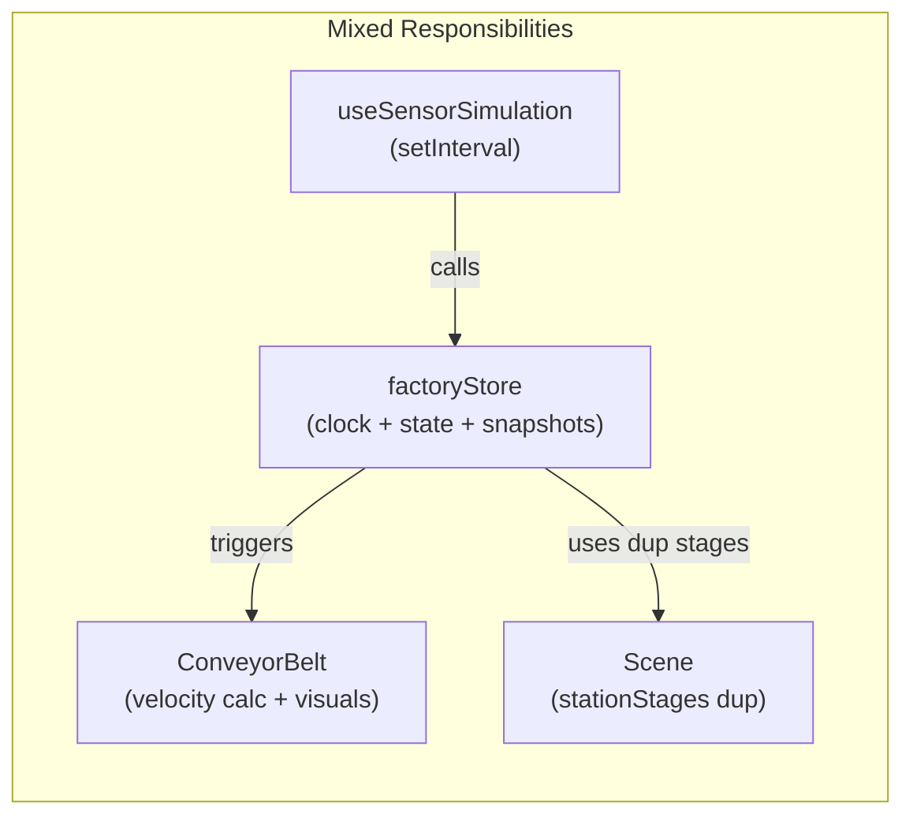
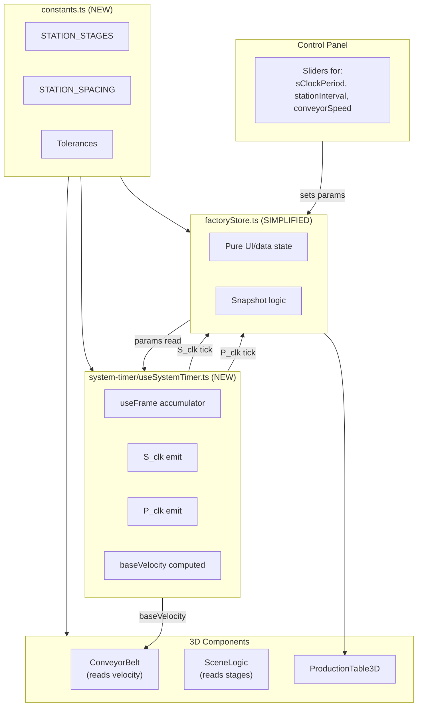

# Simulation Rearchitecture — Implementation Document

> **Goal**: Refactor the virtual factory's timing and simulation layer by introducing a centralized **System Timer** module that becomes the single heartbeat of the simulator. All other components (conveyor, tiles, table, station lights, KPIs) become **subscribers** that react to timer events.

---

## Table of Contents

1. [Problems Being Solved](#1-problems-being-solved)
2. [Architecture Overview](#2-architecture-overview)
3. [Shared Constants Module](#3-shared-constants-module)
4. [System Timer Module](#4-system-timer-module)
5. [Store Refactoring](#5-store-refactoring)
6. [ConveyorBelt Refactoring](#6-conveyorbelt-refactoring)
7. [Scene.tsx Refactoring](#7-scenetsx-refactoring)
8. [ControlPanel Refactoring](#8-controlpanel-refactoring)
9. [Dead Code Removal](#9-dead-code-removal)
10. [File Change Summary](#10-file-change-summary)
11. [Verification Plan](#11-verification-plan)

---

## 1. Problems Being Solved

| #   | Problem                                                                 | Root Cause                       | Section |
| --- | ----------------------------------------------------------------------- | -------------------------------- | ------- |
| P1  | `cFactor` and `pFactor` are independent but must be equal               | Two sliders for a single concept | §5      |
| P2  | `setInterval` and `useFrame` can drift apart                            | Two independent timing systems   | §4      |
| P3  | Same velocity formula duplicated in 3 places                            | No single source of truth        | §3, §4  |
| P4  | `stationStages` array duplicated in 2 files                             | No shared constants              | §3      |
| P5  | Magic numbers (`0.385`, `0.47`, `0.032`, `0.018`) scattered             | No named constants               | §3      |
| P6  | `tilePosition` and `partPositions` are dead state                       | Leftover from earlier iteration  | §9      |
| P7  | `conveyorSpeed` scales the timer interval, causing transient mismatches | Speed applied in two places      | §4      |
| P8  | Clock logic is embedded inside the Zustand store                        | Violates single-responsibility   | §4, §5  |

---

## 2. Architecture Overview

### Current Architecture



### New Architecture



> [!IMPORTANT]
> The **System Timer** is the heart of the simulator. Nothing advances unless the timer emits an event. The `factoryStore` becomes a pure state container — it no longer computes velocity or drives the clock.

---

## 3. Shared Constants Module

### [NEW] [constants.ts](file:///Users/tunckahveci/Desktop/New%20VirtualFactory/virtual-factory-demo/src/lib/constants.ts)

This file centralizes every magic number currently scattered across the codebase.

```typescript
// ─── Station Layout ─────────────────────────────────────
export const STATION_COUNT = 7;
export const STATION_SPACING = 0.0625; // Progress units between stations
export const STATION_STAGES = Array.from(
  { length: STATION_COUNT },
  (_, i) => (i + 1) * STATION_SPACING,
);
// Result: [0.0625, 0.125, 0.1875, 0.25, 0.3125, 0.375, 0.4375]

// ─── Peeking Tolerances ─────────────────────────────────
export const LIGHT_TOLERANCE = 0.018; // For station light activation (Scene.tsx)
export const SNAPSHOT_TOLERANCE = 0.032; // For matrix snapshot (wider to catch between frames)

// ─── Tile Lifecycle Thresholds ──────────────────────────
export const SPAWN_T = STATION_STAGES[0]; // 0.0625 (Press)
export const SORT_THRESHOLD = STATION_STAGES[5] + 0.01; // 0.385  (just past Sorting)
export const COLLECT_THRESHOLD = STATION_STAGES[6] + 0.0325; // 0.47   (just past Packaging)
export const END_OF_LINE_T = 0.5; // Tile removal point

// ─── Defect Rate ────────────────────────────────────────
export const DEFECT_PROBABILITY = 0.05;

// ─── Conveyor Visual ────────────────────────────────────
export const SLAT_COUNT = 100;

// ─── Defaults ───────────────────────────────────────────
export const DEFAULT_S_CLOCK_PERIOD = 500; // ms
export const DEFAULT_STATION_INTERVAL = 4; // S_clk ticks per station
export const DEFAULT_CONVEYOR_SPEED = 1.0; // multiplier
```

> [!NOTE]
> `cFactor` and `pFactor` are unified into a single `STATION_INTERVAL` concept here. This constant controls **both** how many S_clk ticks between tile spawns (P_clk) **and** how fast tiles move visually.

---

## 4. System Timer Module

### [NEW] [useSystemTimer.ts](file:///Users/tunckahveci/Desktop/New%20VirtualFactory/virtual-factory-demo/src/system-timer/useSystemTimer.ts)

This is the core innovation. The System Timer:

1. Runs inside a `useFrame` callback (synced to the rendering loop — no `setInterval`).
2. Accumulates real elapsed time.
3. Emits **S_clk** and **P_clk** events by calling store actions.
4. Computes and exposes the **baseVelocity** as a stable, centralized value.

```typescript
import { useRef } from "react";
import { useFrame } from "@react-three/fiber";
import { useFactoryStore } from "../store/factoryStore";
import { STATION_SPACING } from "../lib/constants";

/**
 * useSystemTimer — The heartbeat of the simulator.
 *
 * Must be rendered inside the R3F <Canvas> tree.
 * Drives all simulation advancement through the store.
 */
export const useSystemTimer = () => {
  const accumulatorRef = useRef(0);

  useFrame((_, delta) => {
    const state = useFactoryStore.getState();

    // ── Guard: Only tick when simulation is active ──
    if (!state.isDataFlowing || state.conveyorStatus !== "running") {
      accumulatorRef.current = 0; // Reset accumulator when stopped
      return;
    }

    // ── Accumulate real time (in milliseconds) ──
    // conveyorSpeed scales how fast time "passes" for the simulation
    accumulatorRef.current += delta * 1000 * state.conveyorSpeed;

    // ── Emit S_clk ticks ──
    // Process ALL pending ticks in this frame (handles lag spikes gracefully)
    while (accumulatorRef.current >= state.sClockPeriod) {
      accumulatorRef.current -= state.sClockPeriod;
      state.advanceSClock(); // New store action (see §5)
    }
  });

  return null; // This hook has no visual output
};

/**
 * Compute the base velocity for tile/slat movement.
 * This is a pure function — call it wherever velocity is needed.
 *
 * @returns Progress units per second (before conveyorSpeed scaling)
 */
export const computeBaseVelocity = (
  sClockPeriod: number,
  stationInterval: number,
): number => {
  const T_station = (sClockPeriod * stationInterval) / 1000; // seconds per station
  return STATION_SPACING / T_station; // progress units per second
};
```

### Why `useFrame` instead of `setInterval`?

| Concern                 | `setInterval` (old)        | `useFrame` (new)        |
| ----------------------- | -------------------------- | ----------------------- |
| Drift vs render loop    | Drifts independently       | Perfectly synced        |
| Tab throttling          | Timer slows, visuals don't | Both slow together      |
| Lag spikes              | Misses ticks               | `while` loop catches up |
| `conveyorSpeed` changes | Requires interval restart  | Instant effect          |
| Cleanup                 | Manual `clearInterval`     | Automatic R3F lifecycle |

### Module boundary rule

> [!CAUTION]
> **No other file should compute velocity or decide when to tick.** All timing flows through `useSystemTimer`. Components read the resulting state from the store or call `computeBaseVelocity()` for visual speed.

---

## 5. Store Refactoring

### [MODIFY] [factoryStore.ts](file:///Users/tunckahveci/Desktop/New%20VirtualFactory/virtual-factory-demo/src/store/factoryStore.ts)

The store becomes a **pure state container**. Clock computation is removed; instead, the System Timer calls new, focused actions.

#### 5.1 — Replace `cFactor` + `pFactor` with `stationInterval`

```diff
 interface FactoryState {
     // Simulation State
-    tilePosition: number;
-    partPositions: number[];
     partPositionsRef: { current: number[] };
     partIdsRef: { current: number[] };
     sClockPeriod: number;
-    cFactor: number;
-    pFactor: number;
+    stationInterval: number;  // S_clk ticks per station (spawn + traversal)
     sClockCount: number;
     pClockCount: number;
     statusMatrix: (string | null)[][];
     showProductionTable: boolean;

     // Actions
-    setSClockPeriod: (period: number) => void;
-    setCFactor: (factor: number) => void;
-    setPFactor: (factor: number) => void;
-    updateSimulation: () => void;
-    setPartPositions: (positions: number[]) => void;
+    setSClockPeriod: (period: number) => void;
+    setStationInterval: (interval: number) => void;
+    advanceSClock: () => void;  // Called by System Timer only
 }
```

#### 5.2 — New `advanceSClock` action

This replaces the old `updateSimulation`. It is simpler because:

- It doesn't guard on `isDataFlowing` / `conveyorStatus` (the timer does that).
- It uses `stationInterval` instead of separate `cFactor` / `pFactor`.
- It imports `STATION_STAGES` and `SNAPSHOT_TOLERANCE` from constants.

```typescript
import {
  STATION_STAGES,
  SNAPSHOT_TOLERANCE,
  DEFAULT_S_CLOCK_PERIOD,
  DEFAULT_STATION_INTERVAL
} from '../lib/constants';

// Inside the store creator:

advanceSClock: () => set((state) => {
    const nextSClockCount = state.sClockCount + 1;
    let nextPClockCount = state.pClockCount;
    let nextStatusMatrix = [...state.statusMatrix];

    // P_clk tick: fires every stationInterval S_clk ticks
    const isPressTick = nextSClockCount % state.stationInterval === 0;
    if (isPressTick) {
        nextPClockCount += 1;

        // Snapshot occupancy from physical positions
        const currentOccupancy = STATION_STAGES.map((stage, idx) => {
            if (idx === 0) return `Tile #${nextPClockCount}`;
            const partIdx = state.partPositionsRef.current
                .findIndex(t => Math.abs(t - stage) < SNAPSHOT_TOLERANCE);
            const partId = partIdx !== -1
                ? state.partIdsRef.current[partIdx]
                : null;
            return partId ? `Tile #${partId}` : null;
        });

        nextStatusMatrix = [currentOccupancy, ...nextStatusMatrix.slice(0, 8)];
    }

    // Randomize KPIs
    const newKpis = state.kpis.map(kpi => {
        const val = parseFloat(kpi.value);
        const variation = (Math.random() - 0.5) * 0.5;
        return { ...kpi, value: (val + variation).toFixed(1) };
    });

    // Randomize defects
    const newDefects = state.defects.map(d => ({
        ...d,
        value: Number(Math.max(0, parseFloat(
            (d.value + (Math.random() - 0.5) * 0.2).toFixed(1)
        )))
    }));

    return {
        sClockCount: nextSClockCount,
        pClockCount: nextPClockCount,
        statusMatrix: nextStatusMatrix,
        kpis: newKpis,
        defects: newDefects
    };
}),
```

#### 5.3 — Initial state changes

```diff
-    tilePosition: 0,
-    partPositions: [],
     partPositionsRef: { current: [] },
     partIdsRef: { current: [] },
-    sClockPeriod: 500,
-    cFactor: 4,
-    pFactor: 4,
+    sClockPeriod: DEFAULT_S_CLOCK_PERIOD,
+    stationInterval: DEFAULT_STATION_INTERVAL,
     sClockCount: 0,
     pClockCount: 0,
```

#### 5.4 — Setter changes

```diff
-    setSClockPeriod: (period) => set({ sClockPeriod: period }),
-    setCFactor: (factor) => set({ cFactor: factor }),
-    setPFactor: (factor) => set({ pFactor: factor }),
+    setSClockPeriod: (period) => set({ sClockPeriod: period }),
+    setStationInterval: (interval) => set({ stationInterval: interval }),
```

#### 5.5 — `resetFactory` changes

```diff
 resetFactory: () => set((state) => ({
     stations: INITIAL_STATIONS,
     kpis: INITIAL_KPIS,
     defects: INITIAL_DEFECTS,
-    tilePosition: 0,
-    partPositions: [],
     partPositionsRef: { current: [] },
     partIdsRef: { current: [] },
     sClockCount: 0,
     pClockCount: 0,
     statusMatrix: Array(9).fill(null).map(() => Array(7).fill(null)),
     isDataFlowing: false,
-    conveyorSpeed: 1,
+    conveyorSpeed: DEFAULT_CONVEYOR_SPEED,
     conveyorStatus: 'stopped',
     resetVersion: state.resetVersion + 1,
     showPassport: false,
     showHeatmap: false,
     showControlPanel: false
 }))
```

---

## 6. ConveyorBelt Refactoring

### [MODIFY] [ConveyorBelt.tsx](file:///Users/tunckahveci/Desktop/New%20VirtualFactory/virtual-factory-demo/src/components/factory/ConveyorBelt.tsx)

#### 6.1 — Import shared constants and `computeBaseVelocity`

```diff
+import { computeBaseVelocity } from '../../system-timer/useSystemTimer';
+import {
+  SLAT_COUNT,
+  SPAWN_T,
+  SORT_THRESHOLD,
+  COLLECT_THRESHOLD,
+  END_OF_LINE_T,
+  DEFECT_PROBABILITY,
+} from '../../lib/constants';
-const SLAT_COUNT = 100;
```

#### 6.2 — `PartSpawner`: Replace inline velocity formula

```diff
 function PartSpawner({ curve, status }: { ... }) {
   const pClockCount = useFactoryStore((state) => state.pClockCount);
   const sClockPeriod = useFactoryStore((state) => state.sClockPeriod);
-  const cFactor = useFactoryStore((state) => state.cFactor);
+  const stationInterval = useFactoryStore((state) => state.stationInterval);
   const conveyorSpeed = useFactoryStore((state) => state.conveyorSpeed);

-  // Natural Speed Calculation:
-  // We want to move 1 station (0.0625 progress) every (sClockPeriod * cFactor) milliseconds.
-  // ...
-  const effectiveSpeed = useMemo(() => {
-    const T_station = (sClockPeriod * cFactor) / 1000;
-    const v_base = 0.0625 / T_station;
-    return (v_base * conveyorSpeed) / 0.05;
-  }, [sClockPeriod, cFactor, conveyorSpeed]);
+  // Single source of truth for velocity
+  const visualVelocity = useMemo(
+    () => computeBaseVelocity(sClockPeriod, stationInterval) * conveyorSpeed,
+    [sClockPeriod, stationInterval, conveyorSpeed]
+  );

-  const SPAWN_T = 0.0625;
```

#### 6.3 — `PartSpawner`: Use named constants for thresholds and velocity

```diff
   // Spawning
   const newPart: PartData = {
     id,
     t: SPAWN_T,
-    isDefected: Math.random() < 0.05,
+    isDefected: Math.random() < DEFECT_PROBABILITY,
     ...
   };

   // Movement (inside useFrame)
-  p.t += delta * effectiveSpeed * 0.05;
+  p.t += delta * visualVelocity;

   // Sort/Collect animations also use visualVelocity
-  p.sortProgress = Math.min(1, p.sortProgress + delta * effectiveSpeed * 0.5);
+  p.sortProgress = Math.min(1, p.sortProgress + delta * visualVelocity * 10);

-  p.collectProgress = Math.min(1, p.collectProgress + delta * effectiveSpeed * 0.6);
+  p.collectProgress = Math.min(1, p.collectProgress + delta * visualVelocity * 12);

   // Thresholds
-  if (p.isDefected && p.t >= 0.385 && !p.isSorted) {
+  if (p.isDefected && p.t >= SORT_THRESHOLD && !p.isSorted) {

-  if (!p.isDefected && p.t >= 0.47 && !p.isCollected) {
+  if (!p.isDefected && p.t >= COLLECT_THRESHOLD && !p.isCollected) {

-  if (p.t >= 0.5) idsToRemove.push(id);
+  if (p.t >= END_OF_LINE_T) idsToRemove.push(id);
```

> [!IMPORTANT]
> The old code had `effectiveSpeed * 0.05` which cancelled out to `v_base * conveyorSpeed`. The new code uses `visualVelocity` directly which equals `v_base * conveyorSpeed` — **same final result**, cleaner math. The sort/collect animation multipliers (`10`, `12`) are calibrated to produce the same visual rate as the old `effectiveSpeed * 0.5` and `effectiveSpeed * 0.6`.

#### 6.4 — `ConveyorBelt`: Replace gearRatio with `computeBaseVelocity`

```diff
 export const ConveyorBelt = () => {
-  const { sClockPeriod, cFactor, conveyorSpeed, conveyorStatus } = useFactoryStore();
+  const { sClockPeriod, stationInterval, conveyorSpeed, conveyorStatus } = useFactoryStore();

-  const gearRatio = useMemo(() => {
-    const T_station = (sClockPeriod * cFactor) / 1000;
-    const v_base = 0.0625 / T_station;
-    return v_base * conveyorSpeed;
-  }, [sClockPeriod, cFactor, conveyorSpeed]);
+  const visualVelocity = useMemo(
+    () => computeBaseVelocity(sClockPeriod, stationInterval) * conveyorSpeed,
+    [sClockPeriod, stationInterval, conveyorSpeed]
+  );

   // In useFrame:
-  offsets.current[i] = (offsets.current[i] + delta * gearRatio) % 1;
+  offsets.current[i] = (offsets.current[i] + delta * visualVelocity) % 1;
 };
```

---

## 7. Scene.tsx Refactoring

### [MODIFY] [Scene.tsx](file:///Users/tunckahveci/Desktop/New%20VirtualFactory/virtual-factory-demo/src/components/factory/Scene.tsx)

#### 7.1 — Mount the System Timer inside the Canvas

```diff
+import { useSystemTimer } from '../../system-timer/useSystemTimer';
+import { STATION_STAGES, LIGHT_TOLERANCE } from '../../lib/constants';

+// Component wrapper to call the hook inside the Canvas tree
+const SystemTimerDriver = () => {
+  useSystemTimer();
+  return null;
+};

 export const Scene = () => {
   // ...
-  const stationStages = [0.0625, 0.125, 0.1875, 0.25, 0.3125, 0.375, 0.4375];

   return (
     <Canvas shadows className="w-full h-full bg-black">
       <Suspense fallback={null}>
+        <SystemTimerDriver />
         <SceneLogic
           stationRefs={stationRefs}
           activeStatesRef={activeStatesRef}
-          stationStages={stationStages}
+          stationStages={STATION_STAGES}
         />
```

#### 7.2 — `SceneLogic`: Use shared tolerance constant

```diff
 const isPhysicalActive = partPositionsRef.current.some(
-  (t) => Math.abs(t - stage) < 0.018,
+  (t) => Math.abs(t - stage) < LIGHT_TOLERANCE,
 );
```

---

## 8. ControlPanel Refactoring

### [MODIFY] [ControlPanel.tsx](file:///Users/tunckahveci/Desktop/New%20VirtualFactory/virtual-factory-demo/src/components/ui/ControlPanel.tsx)

#### 8.1 — Replace `cFactor` + `pFactor` sliders with single `stationInterval`

```diff
 const {
   sClockPeriod,
   setSClockPeriod,
-  cFactor,
-  setCFactor,
-  pFactor,
-  setPFactor,
+  stationInterval,
+  setStationInterval,
   conveyorSpeed,
   // ...
 } = useFactoryStore();

+import { computeBaseVelocity } from '../../system-timer/useSystemTimer';
```

#### 8.2 — Replace the two slider sections with one

Remove the current `c_factor` and `p_factor` sliders entirely. Replace with:

```tsx
{
  /* Station Interval (unified) */
}
<div className="space-y-1">
  <div className="flex justify-between items-center text-[10px] text-white/80 font-bold">
    <span>
      {t("stationInterval")}: {stationInterval}
    </span>
  </div>
  <input
    type="range"
    min="1"
    max="20"
    step="1"
    value={stationInterval}
    onChange={(e) => setStationInterval(parseInt(e.target.value))}
    className="w-full h-1.5 bg-white/20 rounded-lg appearance-none cursor-pointer accent-[#00ff88]"
  />
</div>;
```

#### 8.3 — Fix the "Eff" display formula

```diff
 <div className="text-[14px] font-bold text-white/90 py-1">
   Eff:{" "}
-  {(
-    (1.25 / ((sClockPeriod * cFactor) / 1000)) *
-    conveyorSpeed
-  ).toFixed(2)}
+  {(computeBaseVelocity(sClockPeriod, stationInterval) * conveyorSpeed).toFixed(4)}
   x
 </div>
 <div className="text-[8px] text-white/40 italic leading-none">
-  Linked to s_clk ({sClockPeriod}ms) & c_factor ({cFactor})
+  Linked to s_clk ({sClockPeriod}ms) & station_interval ({stationInterval})
 </div>
```

#### 8.4 — Add translation key

In [translations.ts](file:///Users/tunckahveci/Desktop/New%20VirtualFactory/virtual-factory-demo/src/lib/translations.ts), add:

```diff
+  stationInterval: { tr: 'İstasyon Aralığı', en: 'Station Interval' },
-  c_factor: { tr: 'c_factor (Konveyör)', en: 'c_factor (Conveyor)' },
-  p_factor: { tr: 'p_factor (Pres)', en: 'p_factor (Press)' },
```

---

## 9. Dead Code Removal

### [DELETE] [useSensorSimulation.ts](file:///Users/tunckahveci/Desktop/New%20VirtualFactory/virtual-factory-demo/src/hooks/useSensorSimulation.ts)

This entire file is replaced by the System Timer. Delete it.

### [MODIFY] [App.tsx](file:///Users/tunckahveci/Desktop/New%20VirtualFactory/virtual-factory-demo/src/App.tsx)

Remove the import and call:

```diff
-import { useSensorSimulation } from "./hooks/useSensorSimulation";

 function App() {
-  useSensorSimulation();
   // ...
 }
```

### Store dead state removal

Remove from `FactoryState` interface:

- `tilePosition`
- `partPositions`
- `setPartPositions`
- `updateSimulation`

Remove from initial state:

- `tilePosition: 0`
- `partPositions: []`

Remove from `resetFactory`:

- `tilePosition: 0`
- `partPositions: []`

---

## 10. File Change Summary

| Action     | File                                      | What Changes                                                                                                   |
| ---------- | ----------------------------------------- | -------------------------------------------------------------------------------------------------------------- |
| **NEW**    | `src/lib/constants.ts`                    | All magic numbers, station stages, tolerances, defaults                                                        |
| **NEW**    | `src/system-timer/useSystemTimer.ts`      | `useSystemTimer` hook + `computeBaseVelocity` function                                                         |
| **MODIFY** | `src/store/factoryStore.ts`               | Merge `cFactor`+`pFactor` → `stationInterval`, replace `updateSimulation` → `advanceSClock`, remove dead state |
| **MODIFY** | `src/components/factory/ConveyorBelt.tsx` | Import `computeBaseVelocity` + constants, remove inline formulas                                               |
| **MODIFY** | `src/components/factory/Scene.tsx`        | Mount `SystemTimerDriver`, import `STATION_STAGES` + `LIGHT_TOLERANCE`                                         |
| **MODIFY** | `src/components/ui/ControlPanel.tsx`      | Replace 2 factor sliders with 1 `stationInterval` slider, use `computeBaseVelocity`                            |
| **MODIFY** | `src/lib/translations.ts`                 | Add `stationInterval`, remove `c_factor` / `p_factor`                                                          |
| **MODIFY** | `src/App.tsx`                             | Remove `useSensorSimulation` import and call                                                                   |
| **DELETE** | `src/hooks/useSensorSimulation.ts`        | Entirely replaced by System Timer                                                                              |

---

## 11. Verification Plan

### 11.1 — Build Check

```bash
cd "/Users/tunckahveci/Desktop/New VirtualFactory/virtual-factory-demo"
npm run build
```

**Pass criteria**: Zero TypeScript errors, zero warnings.

### 11.2 — Visual Verification (Browser)

Start dev server and open `http://localhost:5173/`:

```bash
npm run dev
```

**Test sequence**:

1. **Start simulation**: Click the Start button in the Control Panel.
   - ✅ Conveyor slats move.
   - ✅ Tiles spawn at the Press station.
   - ✅ Station lights activate as tiles pass.
   - ✅ Production table updates with new rows.

2. **Stop simulation**: Click Stop.
   - ✅ Everything freezes instantly — no drift, no extra ticks.
   - ✅ Press count does NOT increment while stopped.

3. **Resume simulation**: Click Start again.
   - ✅ Simulation resumes from where it left off.
   - ✅ No "burst" of missed ticks.

4. **Adjust `stationInterval` slider** (was `cFactor` / `pFactor`):
   - Set to 1: tiles move fast, spawn rapidly. Tiles are evenly spaced.
   - Set to 10: tiles move slowly, spawn infrequently. Tiles are evenly spaced.
   - ✅ At **every** value, tiles remain 1-per-station (no pile-ups, no gaps).

5. **Adjust `sClockPeriod` slider**:
   - Set to 100ms: simulation runs fast.
   - Set to 2000ms: simulation runs slowly.
   - ✅ Visual speed matches the expected formula.

6. **Adjust `conveyorSpeed` slider**:
   - Set to 0.3x: everything slows down proportionally.
   - Set to 2.0x: everything speeds up proportionally.
   - ✅ Slat speed matches tile speed at all values.

7. **Defective tile sorting**:
   - ✅ Pink tiles still get thrown into the waste bin at the Sorting station.
   - ✅ Good tiles still drop into shipment box at Packaging.

8. **Reset factory**:
   - ✅ All counters reset to 0.
   - ✅ Table is cleared.
   - ✅ Tiles are removed.

9. **Control Panel UI**:
   - ✅ Only 3 simulation sliders visible: `s_clk`, `Station Interval`, `Conveyor Speed`.
   - ✅ No `c_factor` or `p_factor` sliders.
   - ✅ "Eff" display shows correct computed velocity.

### 11.3 — Console Check

Open browser DevTools console during simulation:

- ✅ No errors.
- ✅ No warnings about missing props or invalid state.
