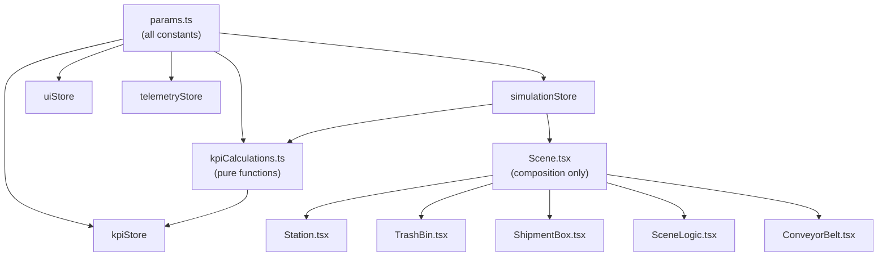

# Refactoring Walkthrough — Virtual Factory Demo

## What Changed

### New Files Created (10)

| File                                                                                                                                  | Purpose                                                          |
| ------------------------------------------------------------------------------------------------------------------------------------- | ---------------------------------------------------------------- |
| [params.ts](file:///Users/tunckahveci/Desktop/New%20VirtualFactory/virtual-factory-demo/src/lib/params.ts)                            | **Centralized parameter module** — every constant in the project |
| [kpiCalculations.ts](file:///Users/tunckahveci/Desktop/New%20VirtualFactory/virtual-factory-demo/src/lib/kpiCalculations.ts)          | Pure functions: FTQ, Scrap, OEE, Energy, Trends, Defects         |
| [uiStore.ts](file:///Users/tunckahveci/Desktop/New%20VirtualFactory/virtual-factory-demo/src/store/uiStore.ts)                        | Language, modals, panel visibility                               |
| [simulationStore.ts](file:///Users/tunckahveci/Desktop/New%20VirtualFactory/virtual-factory-demo/src/store/simulationStore.ts)        | Clocks, matrix, conveyor, tile tracking                          |
| [kpiStore.ts](file:///Users/tunckahveci/Desktop/New%20VirtualFactory/virtual-factory-demo/src/store/kpiStore.ts)                      | KPIs, defects, trend history                                     |
| [telemetryStore.ts](file:///Users/tunckahveci/Desktop/New%20VirtualFactory/virtual-factory-demo/src/store/telemetryStore.ts)          | Supabase sync                                                    |
| [Station.tsx](file:///Users/tunckahveci/Desktop/New%20VirtualFactory/virtual-factory-demo/src/components/factory/Station.tsx)         | Extracted from Scene.tsx                                         |
| [TrashBin.tsx](file:///Users/tunckahveci/Desktop/New%20VirtualFactory/virtual-factory-demo/src/components/factory/TrashBin.tsx)       | Extracted from Scene.tsx                                         |
| [ShipmentBox.tsx](file:///Users/tunckahveci/Desktop/New%20VirtualFactory/virtual-factory-demo/src/components/factory/ShipmentBox.tsx) | Extracted from Scene.tsx                                         |
| [SceneLogic.tsx](file:///Users/tunckahveci/Desktop/New%20VirtualFactory/virtual-factory-demo/src/components/factory/SceneLogic.tsx)   | Extracted from Scene.tsx                                         |
| [useDraggablePanel.ts](file:///Users/tunckahveci/Desktop/New%20VirtualFactory/virtual-factory-demo/src/hooks/useDraggablePanel.ts)    | Shared drag hook (was copy-pasted ×3)                            |
| [useTranslation.ts](file:///Users/tunckahveci/Desktop/New%20VirtualFactory/virtual-factory-demo/src/hooks/useTranslation.ts)          | Shared translation hook                                          |
| [ErrorBoundary.tsx](file:///Users/tunckahveci/Desktop/New%20VirtualFactory/virtual-factory-demo/src/components/ui/ErrorBoundary.tsx)  | Catches 3D scene crashes                                         |

### Deleted Files (3)

- `factoryStore.ts` — replaced by 4 focused stores
- `constants.ts` — merged into `params.ts`
- `App.css` — stale Vite template, not used

### Rewritten Files (12)

`Scene.tsx` (397→110 lines), `ConveyorBelt.tsx`, `ProductionTable3D.tsx`, `ControlPanel.tsx`, `TilePassport.tsx`, `DefectHeatmap.tsx`, `KPIContainer.tsx`, `SimulationControls.tsx`, `Header.tsx`, `BottomToolbar.tsx`, `Playbook.tsx`, `App.tsx`, `energyConfig.ts`, `useSystemTimer.ts`

### Removed Dependencies

`@react-three/cannon`, `cannon-es`, `autoprefixer` (removed from PostCSS config)

---

## Key Architectural Changes



## Bugs Fixed

- CSS class typo `text-green-400Shadow` → proper classes
- Dead `minimized`/`collapsed` state variables removed
- `computeBaseVelocity` moved from hook file to `params.ts`

## Performance Fixes

- Pre-allocated scratch `Vector3` objects in `ConveyorBelt.tsx` (eliminates per-frame GC)
- Granular Zustand selectors on all components (was full-store subscription)
- `statusMatrix` copy only on P_clk ticks (not every S_clk)
- Single-pass KPI calculation (was triple iteration)

## Verification

```
✅ TypeScript: npx tsc --noEmit — zero errors
✅ Vite build: npm run build — built in 2.34s
```
